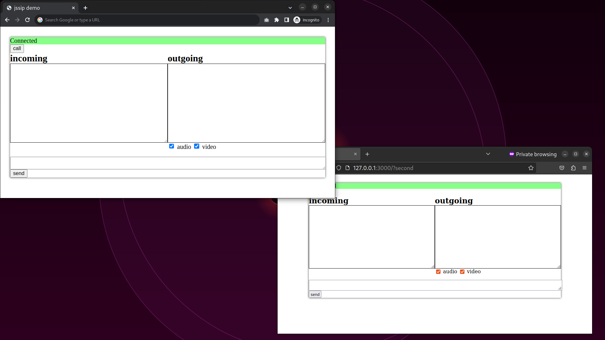

## Quick Start

1. Start SIP Server:

```shell
bin/run
```

2. Open first incognito tab in Google Chrome http://127.0.0.1:3000

3. Open second incognito tab in Firefox http://127.0.0.1:3000?second



## Resources

* https://jssip.net/
* https://github.com/fonoster/routr
* https://github.com/versatica/JsSIP
* https://hub.docker.com/r/fonoster/routr/
* https://jsfiddle.net/msqenm70/2/
* https://pedrosanders.medium.com/tutorial-getting-started-with-routr-sip-server-f66c5216690a
* https://routr.io/docs/introduction/installation/
* https://routr.io/docs/introduction/overview/#use-cases
* https://sipjs.com/guides/server-configuration/
* https://stackoverflow.com/questions/49550881/jssip-play-remote-audio
* https://stackoverflow.com/questions/57532832/how-to-make-a-sip-call-through-nodejs
* https://www.youtube.com/watch?v=S5jYWPB0zr8
* https://www.youtube.com/watch?v=o25iNQbzXXM&list=PLo4vaqmPtSBZ4x9-FXjHh3qELtqDwrScC
